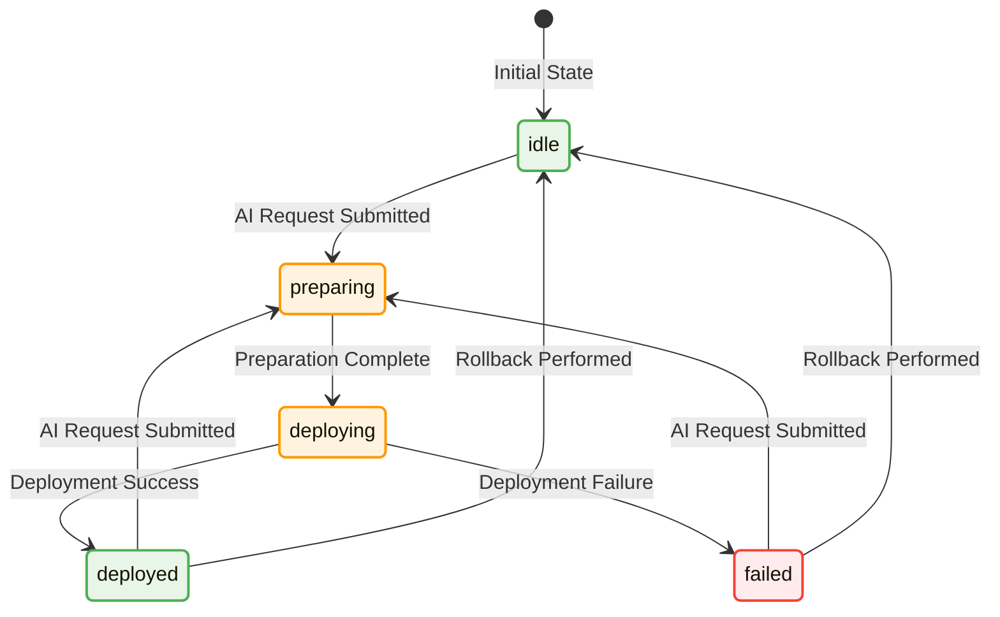

🔒 Deployment State Machine

The implementation creates a robust deployment state machine:

## State Machine Diagram

## Deployment States

| State Category | State | Description |
|---|---|---|
| **READY FOR NEW DEPLOYMENT** | `null/idle` | Project ready for deployment |
| | `deployed` | Previous deployment successful |
| | `failed` | Previous deployment failed |
| **DEPLOYMENT IN PROGRESS (BLOCKED)** | `preparing` | Deployment being prepared |
| | `deploying` | Deployment in progress |

## State Reset Triggers

| Trigger Event | Resulting State | Description |
|---|---|---|
| AI Request Submitted | `idle` | Status reset to allow new deployment |
| Rollback Performed | `idle` | Status reset after rollback operation |
| Deployment Completed | `deployed` | Status updated on successful deployment |
| Deployment Failed | `failed` | Status updated on deployment failure |