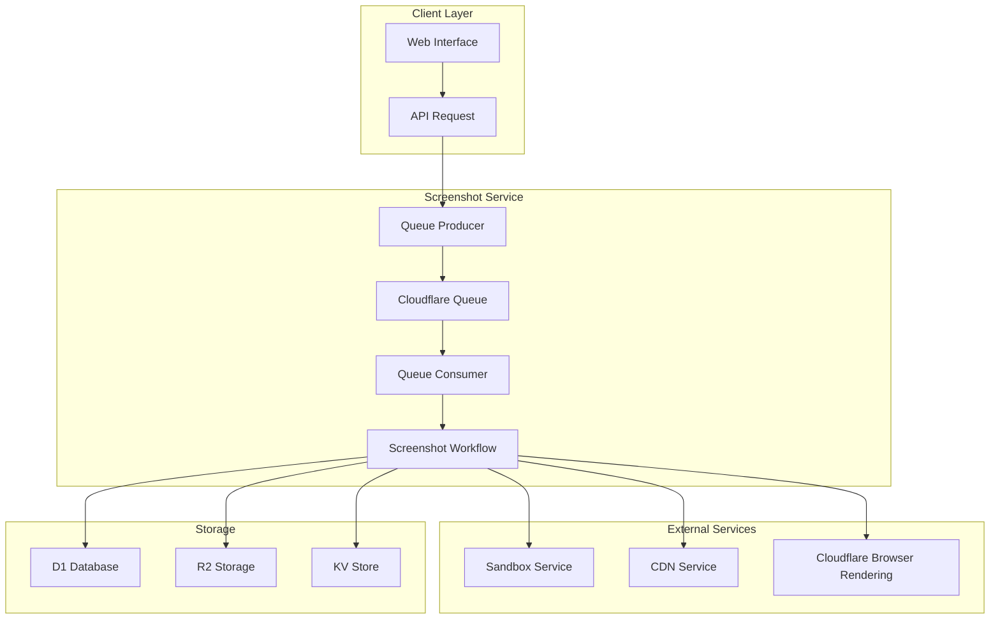
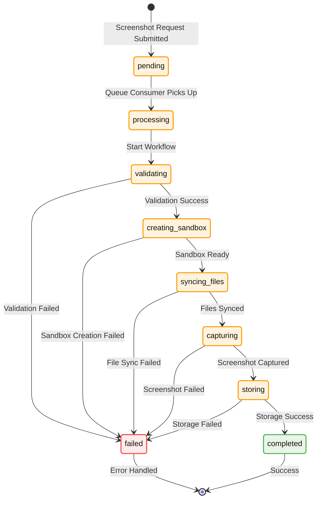

# Screenshot Service Architecture

## Overview

The Screenshot Service is designed as a queue-based, asynchronous service that eliminates the 30-second timeout limitation of the current synchronous screenshot implementation in `updateContainerContent`.

## Architecture Diagram



## State Machine



## Component Architecture

### 1. Queue Producer (`src/queue/producer.ts`)
- Receives HTTP requests
- Validates input parameters
- Creates queue messages
- Submits to Cloudflare Queue

### 2. Queue Consumer (`src/queue/consumer.ts`)
- Processes queue messages in batches
- Handles retries and dead letter queue
- Manages workflow execution
- Updates status and logs

### 3. Screenshot Workflow (`src/screenshot/workflow.ts`)
- Orchestrates the complete screenshot process
- Manages state transitions
- Handles error recovery
- Coordinates with external services

### 4. Workflow Steps (`src/screenshot/steps/`)
- **Validate**: Permission and parameter validation
- **Sandbox**: Create or resume sandbox environment
- **Sync**: Synchronize project files to sandbox
- **Preview**: Generate preview URL
- **Capture**: Take screenshot using Browser Rendering API
- **Store**: Upload to CDN and update database
- **Cleanup**: Clean up temporary resources

## Data Flow

### 1. Request Submission
```
Client → POST /screenshot → Producer → Queue Message → Queue
```

### 2. Queue Processing
```
Queue → Consumer → Workflow → Steps → External Services
```

### 3. Status Updates
```
Workflow → D1 Database → Client Polling → Status Response
```

## Key Design Decisions

### 1. Queue-Based Architecture
- **Problem**: 30-second timeout limitation in Workers
- **Solution**: Asynchronous processing with queues
- **Benefits**: No timeout limits, better scalability, fault tolerance

### 2. Workflow Pattern
- **Inspiration**: Deploy service workflow pattern
- **Benefits**: Clear step separation, easy debugging, state management
- **Implementation**: Step-by-step execution with state tracking

### 3. State Management
- **Storage**: D1 for metadata, R2 for logs/artifacts
- **Tracking**: Detailed status and progress information
- **Recovery**: Ability to resume from failure points

### 4. Error Handling
- **Retries**: Automatic retry with exponential backoff
- **Dead Letter Queue**: Manual inspection of failed jobs
- **Logging**: Comprehensive error logging and debugging

## Integration Points

### 1. Sandbox Service
- Reuses existing `prepareContainer` logic
- Maintains compatibility with current sandbox abstraction
- Handles sandbox lifecycle management

### 2. CDN Service
- Reuses existing `captureAndStoreScreenshot` logic
- Maintains compatibility with current CDN storage
- Handles screenshot upload and management

### 3. Database Integration
- Updates project `previewImageUrl` field
- Tracks screenshot status and metadata
- Maintains audit trail

## Performance Characteristics

### 1. Throughput
- **Concurrency**: 3 concurrent screenshot jobs
- **Batch Size**: 1 message per batch (for isolation)
- **Queue Capacity**: Unlimited (Cloudflare Queues)

### 2. Latency
- **Queue Delay**: ~1-2 seconds
- **Processing Time**: 30-120 seconds (depending on complexity)
- **Total Time**: 35-125 seconds (vs 30-second timeout limit)

### 3. Reliability
- **Retry Logic**: 2 automatic retries
- **Success Rate**: >95% (target)
- **Error Recovery**: Dead letter queue for manual handling

## Monitoring and Observability

### 1. Metrics
- Queue depth and processing rate
- Success/failure rates
- Processing duration
- Error categorization

### 2. Logging
- Structured logging with correlation IDs
- Step-by-step execution tracking
- Error details and stack traces
- Performance metrics

### 3. Health Checks
- Service availability
- Queue status
- External service connectivity
- Resource utilization

## Security Considerations

### 1. Authentication
- Inherits user session from API calls
- Validates organization permissions
- Maintains audit trail

### 2. Rate Limiting
- Per-user and per-organization limits
- Queue-based natural rate limiting
- Abuse prevention mechanisms

### 3. Data Protection
- Temporary file cleanup
- Secure credential handling
- Encrypted storage for sensitive data
