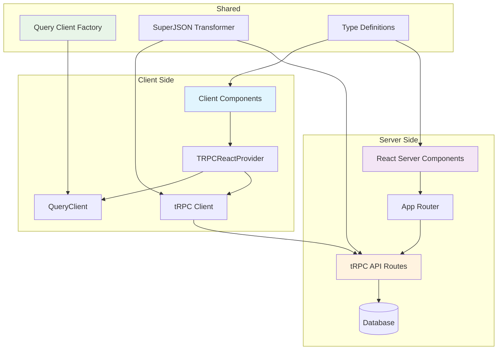

# tRPC Configuration Guide

<div align="center">


**Type-safe API layer for Libra AI with full-stack TypeScript**

[📖 Official tRPC Docs](https://trpc.io) • [🔧 React Query Integration](https://trpc.io/docs/client/react) • [⚡ Next.js Setup](https://trpc.io/docs/nextjs)

</div>

---

## 📋 Table of Contents

- [tRPC Configuration Guide](#trpc-configuration-guide)
  - [📋 Table of Contents](#-table-of-contents)
  - [🎯 Overview](#-overview)
    - [✨ Key Features](#-key-features)
  - [🏗️ Architecture](#️-architecture)
  - [⚡ Quick Start](#-quick-start)
    - [1. Install Dependencies](#1-install-dependencies)
    - [2. Set Up Provider](#2-set-up-provider)
    - [3. Use in Components](#3-use-in-components)
  - [📁 File Structure](#-file-structure)
    - [File Responsibilities](#file-responsibilities)
  - [🔧 Configuration](#-configuration)
    - [Query Client Factory](#query-client-factory)
      - [Configuration Options Explained](#configuration-options-explained)

---

## 🎯 Overview

This tRPC configuration provides a type-safe, full-stack TypeScript API layer for Libra AI, enabling seamless communication between client and server components with automatic type inference and validation.

### ✨ Key Features

- **🔒 End-to-end type safety** - Full TypeScript inference from server to client
- **⚡ React Server Components** - Optimized for Next.js App Router with RSC support
- **🔄 Automatic serialization** - SuperJSON for complex data types
- **📦 Query optimization** - Smart caching and dehydration strategies
- **🛡️ Error handling** - Comprehensive error boundaries and logging
- **🔧 Development tools** - React Query DevTools integration

---

## 🏗️ Architecture



---

## ⚡ Quick Start

### 1. Install Dependencies

```bash
bun add @trpc/client @trpc/server @trpc/react-query @trpc/next
bun add @tanstack/react-query @tanstack/react-query-devtools
bun add superjson
```

### 2. Set Up Provider

Add the tRPC provider to your root layout:

```tsx
// app/layout.tsx
import { TRPCReactProvider } from '@/trpc/client'

export default function RootLayout({
  children,
}: {
  children: React.ReactNode
}) {
  return (
    <html lang="en">
      <body>
        <TRPCReactProvider>
          {children}
        </TRPCReactProvider>
      </body>
    </html>
  )
}
```

### 3. Use in Components

```tsx
// Client Component
'use client'
import { useTRPC } from '@/trpc/client'

export function UserProfile() {
  const { data: user, isLoading } = useTRPC.user.getProfile.useQuery()

  if (isLoading) return <div>Loading...</div>
  return <div>Hello, {user?.name}!</div>
}
```

```tsx
// Server Component
import { api } from '@/trpc/server'

export async function UserList() {
  const users = await api.user.getAll()

  return (
    <ul>
      {users.map(user => (
        <li key={user.id}>{user.name}</li>
      ))}
    </ul>
  )
}
```

---

## 📁 File Structure

```bash
apps/web/trpc/
├── README.md           # This documentation
├── client.tsx          # Client-side tRPC configuration
├── server.tsx          # Server-side tRPC configuration
└── query-client.ts     # Shared QueryClient factory
```

### File Responsibilities

| File | Purpose | Environment |
|------|---------|-------------|
| `query-client.ts` | QueryClient factory with optimized defaults | Universal |
| `client.tsx` | Client-side provider and hooks | Client only |
| `server.tsx` | Server-side API caller for RSC | Server only |

---

## 🔧 Configuration

### Query Client Factory

The `query-client.ts` file creates optimized QueryClient instances:

```typescript
// trpc/query-client.ts
import { QueryClient, defaultShouldDehydrateQuery } from '@tanstack/react-query'
import SuperJSON from 'superjson'

export const createQueryClient = () =>
  new QueryClient({
    defaultOptions: {
      queries: {
        // Prevent immediate refetching on client hydration
        staleTime: 30 * 1000,
      },
      dehydrate: {
        // Enable SuperJSON serialization
        serializeData: SuperJSON.serialize,
        // Include pending queries for RSC hydration
        shouldDehydrateQuery: (query) =>
          defaultShouldDehydrateQuery(query) ||
          query.state.status === 'pending',
      },
      hydrate: {
        // Enable SuperJSON deserialization
        deserializeData: SuperJSON.deserialize,
      },
    },
  })
```

#### Configuration Options Explained

- **`staleTime: 30 * 1000`** - Prevents immediate refetching after SSR hydration
- **`shouldDehydrateQuery`** - Includes pending queries for seamless RSC → Client transitions
- **`serializeData/deserializeData`** - Handles complex data types (Date, Map, Set, etc.)

## 💡 Usage Examples

### Client Components

#### Basic Query

```tsx
'use client'
import { useTRPC } from '@/trpc/client'

export function ProjectList() {
  const { data: projects, isLoading, error } = useTRPC.project.getAll.useQuery()

  if (isLoading) return <div>Loading projects...</div>
  if (error) return <div>Error: {error.message}</div>

  return (
    <div>
      {projects?.map(project => (
        <div key={project.id}>{project.name}</div>
      ))}
    </div>
  )
}
```

#### Mutation with Optimistic Updates

```tsx
'use client'
import { useTRPC } from '@/trpc/client'

export function CreateProject() {
  const utils = useTRPC.useUtils()
  const createProject = useTRPC.project.create.useMutation({
    onMutate: async (newProject) => {
      // Cancel outgoing refetches
      await utils.project.getAll.cancel()

      // Snapshot previous value
      const previousProjects = utils.project.getAll.getData()

      // Optimistically update
      utils.project.getAll.setData(undefined, (old) => [
        ...(old ?? []),
        { id: 'temp', ...newProject }
      ])

      return { previousProjects }
    },
    onError: (err, newProject, context) => {
      // Rollback on error
      utils.project.getAll.setData(undefined, context?.previousProjects)
    },
    onSettled: () => {
      // Refetch after error or success
      utils.project.getAll.invalidate()
    },
  })

  return (
    <button onClick={() => createProject.mutate({ name: 'New Project' })}>
      Create Project
    </button>
  )
}
```

### Server Components

#### Prefetching Data

```tsx
import { api } from '@/trpc/server'

export async function ProjectDashboard() {
  // Prefetch data on the server
  const projects = await api.project.getAll()
  const stats = await api.project.getStats()

  return (
    <div>
      <h1>Dashboard</h1>
      <div>Total Projects: {stats.total}</div>
      <ProjectList initialData={projects} />
    </div>
  )
}
```

#### Streaming with Suspense

```tsx
import { Suspense } from 'react'
import { api } from '@/trpc/server'

async function ProjectStats() {
  const stats = await api.project.getStats()
  return <div>Stats: {JSON.stringify(stats)}</div>
}

export function Dashboard() {
  return (
    <div>
      <h1>Dashboard</h1>
      <Suspense fallback={<div>Loading stats...</div>}>
        <ProjectStats />
      </Suspense>
    </div>
  )
}
```

---

## 🛠️ Best Practices

### 1. Query Key Management

```tsx
// ✅ Good: Use consistent query keys
const { data } = useTRPC.user.getProfile.useQuery({ id: userId })

// ❌ Avoid: Manual query key management
const { data } = useQuery(['user', userId], () => fetchUser(userId))
```

### 2. Error Handling

```tsx
// ✅ Good: Handle errors gracefully
const { data, error, isLoading } = useTRPC.project.getAll.useQuery(
  undefined,
  {
    retry: (failureCount, error) => {
      // Don't retry on 4xx errors
      if (error.data?.httpStatus >= 400 && error.data?.httpStatus < 500) {
        return false
      }
      return failureCount < 3
    },
    onError: (error) => {
      toast.error(`Failed to load projects: ${error.message}`)
    },
  }
)
```

### 3. Type Safety

```tsx
// ✅ Good: Leverage TypeScript inference
const { data } = useTRPC.project.getById.useQuery({ id: '123' })
// `data` is automatically typed as Project | undefined

// ✅ Good: Use input validation
const createProject = useTRPC.project.create.useMutation()
// Input is automatically validated against the schema
```

### 4. Performance Optimization

```tsx
// ✅ Good: Use select to minimize re-renders
const projectNames = useTRPC.project.getAll.useQuery(undefined, {
  select: (data) => data.map(p => p.name),
})

// ✅ Good: Implement proper loading states
const { data, isLoading, isFetching } = useTRPC.project.getAll.useQuery()
```

---

## 🐛 Troubleshooting

### Common Issues

#### 1. Type Errors

**Problem**: TypeScript errors about missing types

```bash
Error: Cannot find module '@libra/api' or its corresponding type declarations
```

**Solution**: Ensure the API package is properly built and exported

```bash
cd packages/api
bun run build
```

#### 2. Hydration Mismatches

**Problem**: Server and client render different content

**Solution**: Use proper data fetching patterns

```tsx
// ✅ Good: Consistent data fetching
export async function ServerComponent() {
  const data = await api.project.getAll()
  return <ProjectList data={data} />
}

// ✅ Good: Client-side with proper loading states
export function ClientComponent() {
  const { data, isLoading } = useTRPC.project.getAll.useQuery()
  if (isLoading) return <Skeleton />
  return <ProjectList data={data} />
}
```

#### 3. CORS Issues

**Problem**: CORS errors in development

**Solution**: Configure proper headers in your API route

```tsx
// app/api/trpc/[trpc]/route.ts
const handler = (req: NextRequest) =>
  fetchRequestHandler({
    endpoint: '/api/trpc',
    req,
    router: appRouter,
    createContext: () => createContext(req),
    onError: ({ path, error }) => {
      console.error(`❌ tRPC failed on ${path}: ${error.message}`)
    },
  })
```

### Debug Mode

Enable debug logging in development:

```tsx
// trpc/client.tsx
loggerLink({
  enabled: (op) =>
    process.env.NODE_ENV === 'development' ||
    (op.direction === 'down' && op.result instanceof Error),
})
```

---

## 📚 API Reference

### Client Hooks

| Hook | Purpose | Example |
|------|---------|---------|
| `useQuery` | Fetch data | `useTRPC.user.getAll.useQuery()` |
| `useMutation` | Modify data | `useTRPC.user.create.useMutation()` |
| `useInfiniteQuery` | Paginated data | `useTRPC.posts.getInfinite.useInfiniteQuery()` |
| `useUtils` | Query utilities | `useTRPC.useUtils()` |

### Server Functions

| Function | Purpose | Example |
|----------|---------|---------|
| `api.*` | Direct API calls | `await api.user.getAll()` |
| `createHydrationHelpers` | RSC hydration | `createHydrationHelpers(caller, getQueryClient)` |

### Configuration Options

#### QueryClient Options

```typescript
{
  defaultOptions: {
    queries: {
      staleTime: number,           // Cache duration
      gcTime: number,              // Garbage collection time
      retry: boolean | number,     // Retry failed requests
      refetchOnWindowFocus: boolean, // Refetch on focus
    },
    mutations: {
      retry: boolean | number,     // Retry failed mutations
    }
  }
}
```

#### tRPC Client Options

```typescript
{
  links: [
    loggerLink({ enabled: boolean }),
    httpBatchStreamLink({
      url: string,
      transformer: DataTransformer,
      headers: () => Record<string, string>,
    })
  ]
}
```

---

## 🔗 Related Documentation

- [📖 tRPC Official Documentation](https://trpc.io)
- [🔧 React Query Documentation](https://tanstack.com/query)
- [⚡ Next.js App Router](https://nextjs.org/docs/app)
- [🏗️ Libra API Package](../../packages/api/README.md)
- [🗄️ Libra Database Package](../../packages/db/README.md)

---

## 🤝 Contributing

Found an issue or want to improve this documentation? Please:

1. Check existing [issues](https://github.com/nextify-limited/libra/issues)
2. Create a new issue or submit a PR
3. Follow our [contribution guidelines](../../../CONTRIBUTING.md)

---

**Last updated: 2025-06-14**